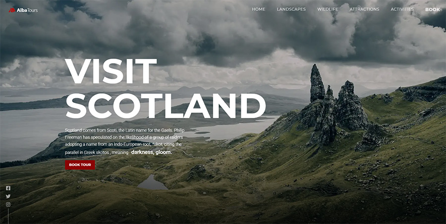

# Scotland Travel Landing Page

A landing page for a Scotland travel tour company, built with Gatsby.js.

## Site

Here is a link to the site: [https://alba-tours.netlify.app/](https://alba-tours.netlify.app/)

## Technologies

Project is created with:

* Gatsby.js - static site generator
* React.js - frontend framework
* Strapi CMS - content management platform
* Styled Components - CSS-in-JS styling library 
* Bootstrap - CSS framework

## Setup

1. After you clone this repo to your desktop, go to its root directory and run `npm install` to install its dependencies.

2. This project requires a [Strapi backend](https://github.com/u-konrad/scotland-backend). Download it and set it up according to instructions.

3. Create a `.env` and provide a value for STRAPI_URL variable pointing to your Strapi server.

4. Once the dependencies are installed, you can run `gatsby develop` to start the application. You will then be able to access it at `localhost:8000`. 

